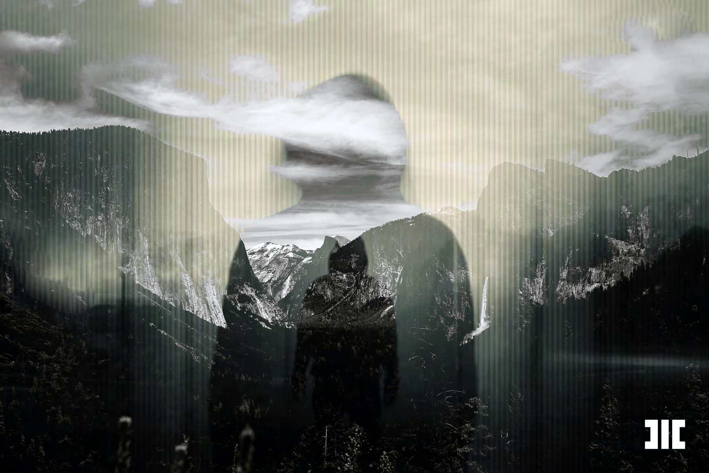

# MOTHNODE_ Seeking Night Sky (prod. Yung Venxm)

**Listen now:** 

## Chapter Setup

Operatives are setting up a ritual in a remote field, getting rid of an inverted hierophant body - squad has set up tech boxes around surrounding the arcane perimeter, ritual paraphenalia are being sorted out, a body is revealed being prepared for being neutralized.

## Project Data

Description.

> **Title:** Seeking Night Sky / **Featuring:** MOTHNODE

> **Production:** Wodzu Beats / **Lyrics:** MOTHNODE

> **Beat:** Yung Venxm

> **Narrative Design:** MOTHNODE

> **Music Video Credits:** MOTHNODE


## Lyrics

```
i've been seeking night sky I might die 
call me up another time, ritual it's tonight 
onto fighting on another day, gotta say such a playa
all i ever said was get it right

fearsome of the blight, masses for the carcer
imma stay onto my promise, they might see me as a martyr
i just think i'm out of time but i haven't still decided
staying silent is a problem but i'm saved by the tar           /// i've been saved by the tar
saved by the tar

saved by the tar aah
i decided why try, semitones crash (loud)
none of this shit is fine
none of these damn rules apply
imma take my own pride

```

## Lore Notes

## Music Video

## Short Cinematic Film

Setting up a ritual in a remote field - tech boxes around, ritual paraphenalia and a body revealed at the end of the music video (half-buried).

## Miscellaneous Notes
